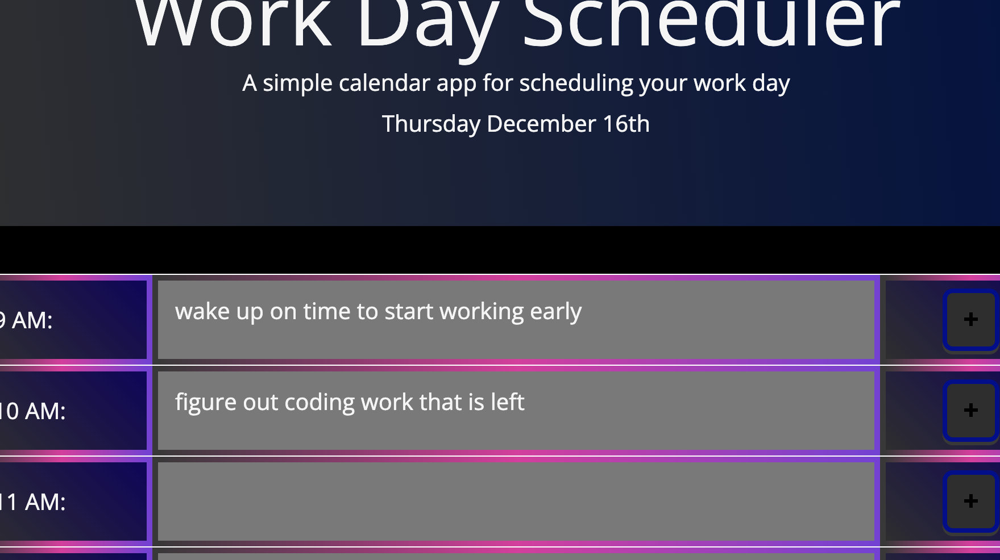

# Workday Scheduler

## Purpose: 
- to allow the user to designate workday events on an interactive page
- select and edit events to change their titles
- as events come up or pass their color on the page changes
- allow timeslots to change background color depending on time proximity
- save tasks to local storage for persistence

https://gregoryjohncarter.github.io/workday-scheduler/

